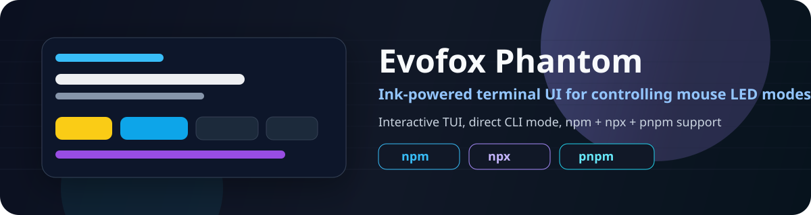
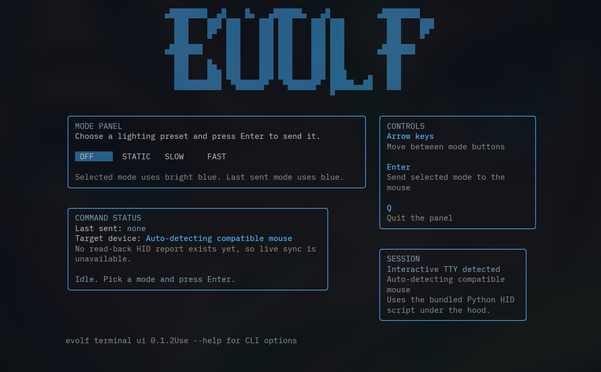

<p align="center">
  
</p>

<p align="center">
  <a href="https://www.npmjs.com/package/evolf-cli"></a>
  
  
  
</p>

<p align="center">
  
  
  
</p>

<p align="center">
  A polished terminal UI for controlling LED modes on the <b>Amkette Evofox Phantom</b> mouse.<br />
  Built with <b>Ink + React</b>, powered by a lightweight <b>Python HID backend</b>, with a simple install flow for <b>npx</b>, <b>npm</b>, and <b>pnpm dlx</b>.
</p>

## Preview

<p align="center">
  
</p>

<p align="center">
  This is how the current TUI looks when launched with <code>evolf</code>.
</p>

## Why This Project Exists

The mouse ships with a Windows-only configuration utility. This repo provides a clean Linux-friendly alternative focused on the LED controls that users actually need day to day.

## Highlights

| Capability | Details |
| --- | --- |
| Interactive TUI | Navigate modes with arrow keys and send commands with Enter |
| Direct CLI mode | Run `evolf --mode slow` for scripts or quick toggles |
| Auto-detection | Tries to find a compatible mouse automatically |
| Manual overrides | Supports `--vid` and `--pid` for hardware variants |
| Simple install | Quick start with `npx`, persistent install with `npm`, optional `pnpm dlx` |
| Publishable package | Ready for npm distribution with bundled runtime files |

## Features

- LED modes: `off`, `static`, `slow`, `fast`
- Ink-based terminal UI exposed as `evolf`
- Python HID backend bundled in the published package
- Works in interactive TTY mode and supports non-interactive direct commands
- Public-package friendly layout without machine-specific paths

## Requirements

Before using the tool, make sure these are available:

- Node.js `20+`
- Python `3`
- Python package `hidapi`

Install `hidapi`:

```bash
pip install hidapi
```

Arch Linux:

```bash
sudo pacman -S python-hidapi
```

## Installation

### Quick start (recommended)

Run it instantly without installing anything globally:

```bash
npx evolf-cli
```

### Install the `evolf` terminal command

If you want to launch the app by typing `evolf`, run these commands in this order:

```bash
npm config set prefix ~/.local
export PATH="$HOME/.local/bin:$PATH"
npm install -g evolf-cli
evolf
```

To keep that `PATH` change permanently, add this line to your shell config such as `~/.bashrc`:

```bash
export PATH="$HOME/.local/bin:$PATH"
```

### Alternative without global install

```bash
pnpm dlx evolf-cli
```

`pnpm add -g evolf-cli` is intentionally not recommended here because it depends on each user's global pnpm `PATH` setup.

## Usage

### Launch the interactive UI

```bash
evolf
```

### Send a mode directly

```bash
evolf --mode slow
evolf --mode static
```

### Override USB vendor and product IDs

```bash
evolf --vid 0x30fa --pid 0x1440
evolf --vid 0x30fa --pid 0x1440 --mode fast
```

### Show help

```bash
evolf --help
```

## Product ID Notes

Do not assume every user will have the exact same `VID` and `PID`.

These values can differ because of:

- hardware revisions
- firmware revisions
- controller changes
- different vendor batches
- alternate USB presentations of the same product line

That is why this tool supports both:

- auto-detection by default
- manual override with `--vid` and `--pid`

## Development

This repo is configured as a `pnpm` workspace and still works with `npm`.

### pnpm workflow

```bash
pnpm install
pnpm dev
pnpm build
```

### npm workflow

```bash
npm install
npm run dev
npm run build
```

### Local command install

Using pnpm-oriented development:

```bash
make install-cli
```

Using npm-oriented development:

```bash
make install-cli-npm
```

## Project Layout

```text
.
├── evolf.py            # Python HID backend
├── src/index.tsx       # Ink terminal UI entry
├── images/gui.png      # UI screenshot used in the README
├── images/banner.svg   # README hero banner
├── package.json        # Publishable npm package metadata
└── pnpm-workspace.yaml # pnpm workspace config
```

## Current Limitations

- the tool sends LED commands but does not read back the current LED state from the mouse
- the UI shows the last successful command sent, not a live synchronized device state
- compatibility depends on the HID behavior of the connected mouse variant

## License

Released under the [MIT License](./LICENSE).
